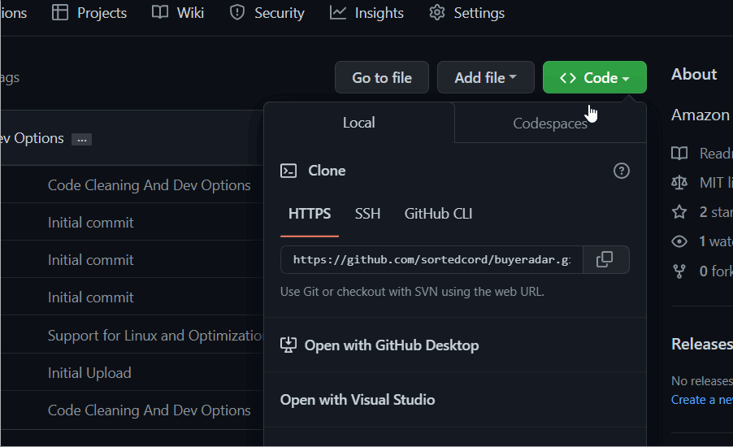
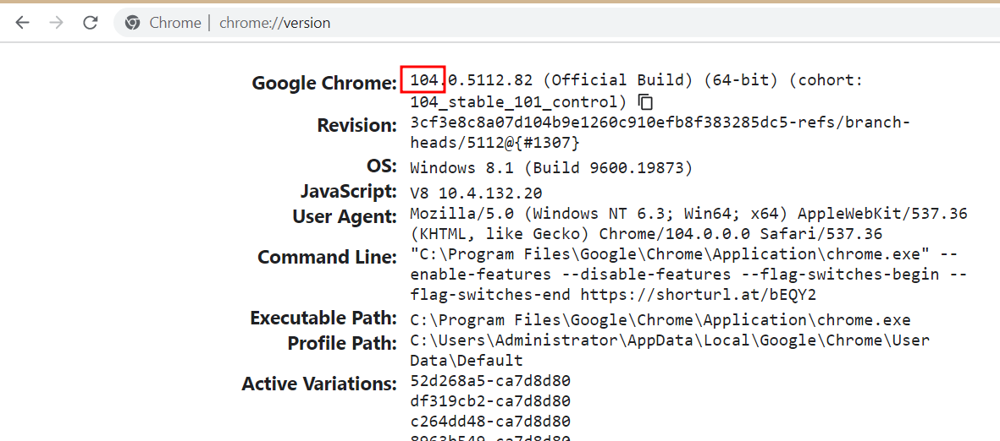
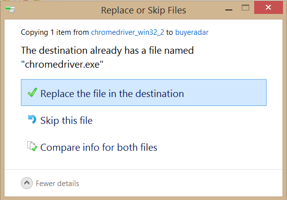

# Buyeradar
A e-commerce product price tracker made with PyQt and Selenium.

## How to run

1. ### Cone/ Download the repository

    If you have git installed in your PC then simply clone this repository.

    ```sh
    git clone https://github.com/sortedcord/buyeradar.git
    ```
    If you don't have it installed then manually download and extract the contents of the zip file.

    

2. ### Intall the required libraries

    ```sh
    pip install selenium requests lxml bs5 pyqt5
    ```

2. ### Updating Chromedriver [IMPORTANT]

    Selenium works with the help of a chromedriver which is specific to the browser version of you computer.

    - Check the version of your chrome

        Go to [chrome://version](chrome://version) and check your chrome version

        
    
    - Then go [here](https://chromedriver.chromium.org/downloads) and download the chromedriver specific to your browser

    Replace the chromedriver present in this repository with the newly download chromedriver with the same name

    
    

3. ### Run the program

    ```sh
    python main.py
    ```

## Debug Mode

This application relies mainly on e-commerce websites. While testing out the application and bugfixing, it is obvious that we would need to run this application many times. Sometimes, the websites tend to block our requests from accessing the site which is why a debug mode has been created so that we would need not wait for the website to load and fetch HTML every single time. 